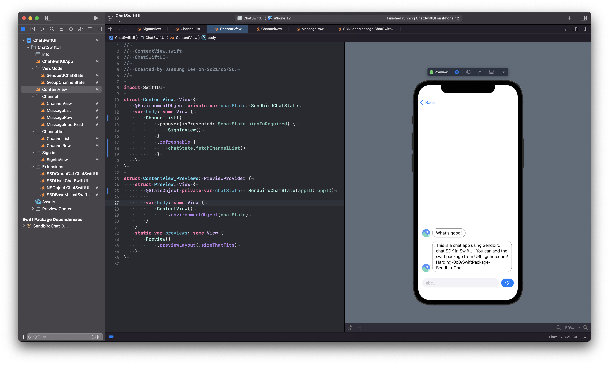
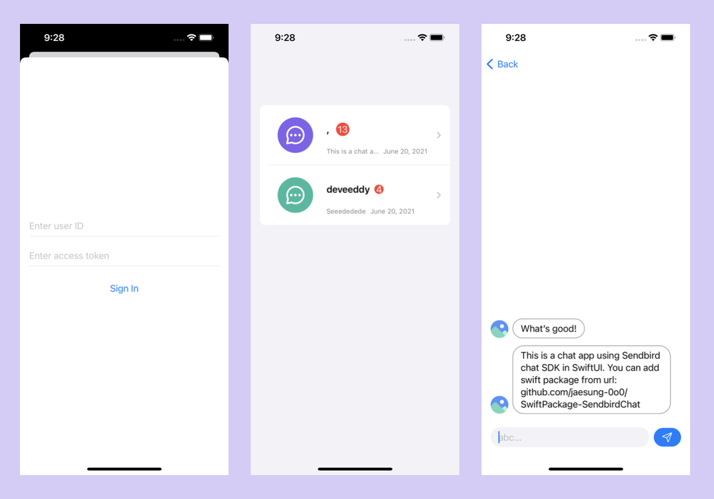

# SwiftUI-ChatApp
Chat app using SendbirdChat Swift Package in SwiftUI

## Requirements

- Xcode 13 beta+
- iOS 15+

## Swift Package

### SendbirdChat

URL: https://github.com/jaesung-0o0/SwiftPackage-SendbirdChat

## Sign In

### View model

See `SendbirdChatState`

### View

`SignInView`

## Channel list

### View model

See `SendbirdChatState`

### View hierarchy

`ChannelList`
    - `ChannelRow`

## Channel

### View model

See `GroupChannelState`

### View hierarchy

`ChannelView`
    - `MessageList`
        - `MessageRow`
    - `MessageInputField`
